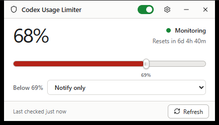
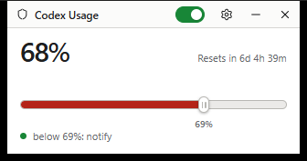
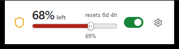
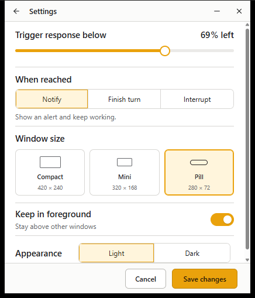

# Codex Usage Limiter

Codex Usage Limiter is an unofficial Windows desktop utility that watches the signed-in Codex account's rate limits and applies a chosen response when your remaining quota drops below a floor you set.

It is derived from [Dimillian/CodexMonitor](https://github.com/Dimillian/CodexMonitor). The upstream copyright and MIT license are retained. This project is not affiliated with or endorsed by OpenAI.



## What it does

- Polls the primary and secondary rate-limit windows from the local Codex app-server (immediately on launch, then every 10 seconds) and shows the window closer to running out as one **% remaining** figure with its reset countdown.
- Lets you drag a grabber along the usage bar to set the floor — the bar turns red once remaining quota falls below it.
- Fires one of three responses when remaining quota crosses the floor:
  - **Notify only** — show a native Windows notification and keep working.
  - **Finish current turn** — block new inference, let turns active at the crossing finish, then pause.
  - **Interrupt immediately** — block new inference and interrupt owned active turns.
- The green titlebar switch arms/disarms responses. Disarmed, the app keeps tracking and displaying usage but takes no action.
- Persists quota state, owned-turn identities, deadlines, and reset verification across restarts, and revalidates account identity before reopening inference.

The limiter controls only Codex sessions launched through this application. It does not control separate terminals or other Codex clients — but it tracks and displays account-level usage regardless of where you spend it.

## Window modes

Pick a size under Settings → Window size. Settings also has a **Keep in foreground** toggle (always-on-top) and light/dark appearance.

| Compact (420×240) | Mini (320×168) | Pill (280×72) |
| --- | --- | --- |
|  |  |  |

Compact keeps every control on the surface. Mini is a glance card. Pill is a titlebar-less sliver you can park in a screen corner — drag anywhere on it to move it.



## Install

Grab the zip from the [latest release](../../releases/latest), unzip, and run `codex-usage-limiter.exe`. Requirements:

- Windows 10 or 11 (WebView2 runtime, preinstalled on both)
- [Codex CLI](https://developers.openai.com/codex/cli) installed and signed in

On first run, connect the folder where you use Codex when prompted — the limiter reads usage and proves account identity through a local Codex app-server session in that workspace. Tracking starts automatically once a workspace is connected.

## Build from source

Requirements: Node.js 20+, npm, and a stable Rust toolchain. No other native tooling is needed.

```bash
git clone https://github.com/charlie12520/codex-usage-limiter.git
cd codex-usage-limiter
npm ci
npm run build
cd src-tauri
cargo build --release --bin codex-usage-limiter --features custom-protocol
```

The exe lands at `src-tauri/target/release/codex-usage-limiter.exe`.

For development with hot reload:

```bash
npm run tauri:dev:win
```

Verification:

```bash
npm test
npm run typecheck
npm run build
cd src-tauri && cargo test
```

## Safety model

Quota enforcement is backend-authoritative. Inference admission closes before interrupt, drain, parked, verification, and intervention states. The frontend controls are only a projection of the Rust quota-guard state.

A connected local workspace is required before the limiter can track usage because account identity and turn ownership must be proven through a local Codex app-server session.

## License

MIT — see [LICENSE](LICENSE). Original work copyright (c) 2026 Thomas Ricouard ([Dimillian/CodexMonitor](https://github.com/Dimillian/CodexMonitor)); modifications for the standalone usage limiter build on that foundation.
